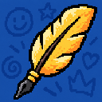
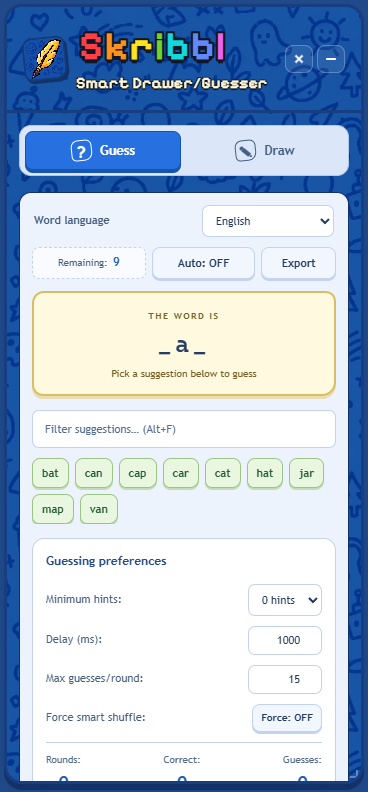
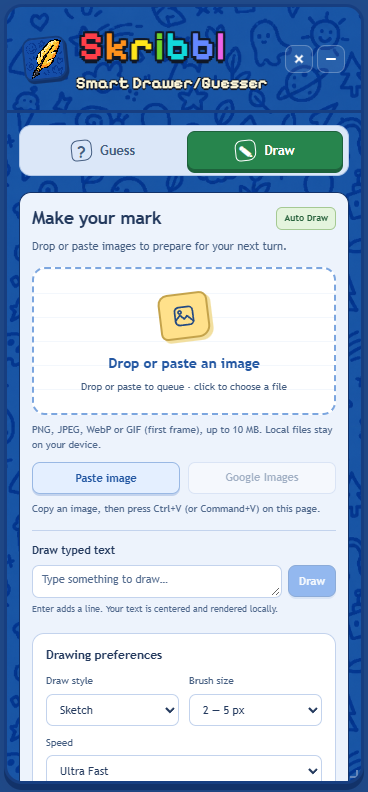
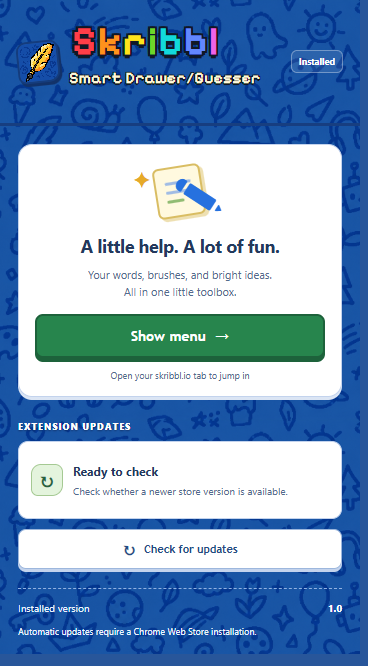
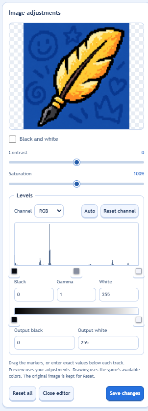
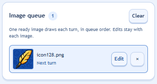
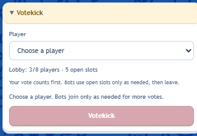

<p align="center">
  
</p>

# Skribbl Smart Drawer/Guesser

**A floating toolbox for skribbl.io: find matching words, turn images into drawings, and prepare your next turn.**

Version **1.0** · Chrome / Chromium-based Edge · Manifest V3 · No build step

The extension adds a movable, resizable panel to [skribbl.io](https://skribbl.io).
The **Guess** tab matches the visible hint against local word collections. The
**Draw** tab converts images or typed text into drawing commands. Its pixel-style
title, quill icon and blue doodle background are packaged locally.

<table>
  <tr><th>Guess words</th><th>Create drawings</th><th>Open the toolbox</th></tr>
  <tr>
    <td valign="top"></td>
    <td valign="top"></td>
    <td valign="top"></td>
  </tr>
</table>

Screenshots show the current extension UI. Example hints, queued images and the
private-lobby roster use local demo data; no multiplayer session was joined to
create them. The popup was captured from an installed unpacked extension.

[Install](#install) · [Guessing](#guessing) · [Drawing](#drawing) · [Panel controls](#panel-controls) · [Privacy](#privacy-and-permissions) · [Development](#development)

## Install

1. Download or clone this repository and unzip it if necessary.
2. Open `chrome://extensions` in Chrome, or `edge://extensions` in Edge.
3. Enable **Developer mode**, then choose **Load unpacked**.
4. Select **`Skribbl-io-auto-drawer`**, the directory containing `manifest.json`.
5. Open or refresh [skribbl.io](https://skribbl.io). The panel appears on the page.
6. Pin the extension from the browser's Extensions menu for easy access to **Show menu**.

There is no npm install, compilation step, API key or image-search account to configure.

**Updating:** after replacing the extension files, click **Reload** on its entry in
the extensions page, then refresh the game tab. The popup's store-update check
does not install local source changes. This project is supplied as an unpacked
extension; this repository has not been published as a Chrome Web Store listing.

**Existing installations:** the rename from Skribbl Quill preserves version 1.0,
extension ID `bpjccmbldjbdpkgaikbejoninpmgaidd`, and its stored preferences. If you
are switching from the older extension with a different ID, export learned words
first, then load this one. Different IDs have separate settings and learned-word
storage. This extension uses its own panel IDs, CSS names and drawing/votekick
events, so it can coexist with the original Auto Guess And Draw extension.
Drop or paste images into this extension's **Draw panel**, or use **Paste image**;
canvas drops and pastes outside the panel remain available to the game and other
extensions. Keyboard shortcuts apply while focus is inside this panel.
Both extensions still use the same game canvas and chat: run one automated
drawer or guesser at a time to avoid competing drawing commands or duplicate guesses.

## Guessing

1. Select **Guess** and choose **Word language**. Set the game's room language to
   match; this selector changes the extension's collection, not the room settings.
2. As a hint appears, the panel finds matching words. For example, `_a_` can match
   `cat`, `hat` or `map`. Revealed letters and word lengths narrow the candidates.
3. Use the search field to filter the suggestions, then **click a word to submit it**.
4. To submit automatically, click **Auto: OFF** to enable Auto Guess.

English, German, French, Korean, Polish and Spanish are available. Matching handles
accents, Unicode and multi-word phrases. Collections, learned words and ranking
history stay separate for each language.

| Preference | What it does |
| --- | --- |
| **Minimum hints** | Auto and Force wait for 0–5 revealed letters or digits. Default: 0. Manual clicks and `Alt+1` remain available. |
| **Delay (ms)** | Sets the interval between automatic guesses. |
| **Max guesses/round** | Limits normal Auto while the candidate list is broad. When it narrows to 25 or fewer, Auto may finish the remaining candidates. |
| **Force smart shuffle** | Enables automatic guessing without the per-round limit. It still respects Minimum hints. |

Before letters are revealed, automatic selection is random. After a letter appears,
the extension prioritizes successful and learned words, with word length and
alphabetical order used in ranking. Force shuffles equally ranked candidates.
Automatic guessing pauses when the page is hidden, offline, or chat is unavailable.

The extension learns words from recognized round-reveal and successful-guess
messages. **Import words**, **Export** and **Reset learned** manage the selected
language's learned collection. **Sync words** is optional and available for English
only; see [Privacy](#privacy-and-permissions).

The dictionaries are community collections, not a verified complete server word
list. Private custom words can be missing. Sources, counts and licenses are listed
in [WORD-SOURCES.md](WORD-SOURCES.md).

## Drawing

Open **Draw** to choose a local image, drop one onto the Draw panel,
paste from the clipboard, or type text. The tabs also switch automatically as your
turn changes.

| Input | During your drawing turn | Outside your drawing turn |
| --- | --- | --- |
| **Drop or paste an image** | Draws automatically when Auto-paint is on; opens the editor when it is off. | Adds the image to the queue and opens its editor. |
| **Click the upload area and choose a file** | Opens the editor; waits for **Draw image**. | Adds the image to the queue for editing. |
| **Type text and click Draw** | Renders the text locally and draws it. Enter adds a line. | Text drawing is unavailable until your turn. |

**Auto-paint images on drop or paste starts ON.** Turn it off if you want to review
every dropped or pasted image before painting. New drawing preferences are
**Sketch**, **brush level 2 / 5 px**, and **Ultra Fast**. Existing preferences are retained.

Use **Paste image** for an explicit clipboard read, or press `Ctrl+V` / `Command+V`
after copying an image and focusing a control in the Draw panel. Ordinary text
pastes still work in text fields and chat.
If browser clipboard access fails, try the keyboard shortcut or save the image
and use the file picker.

### Adjust an image before drawing



The editor supports black-and-white conversion, contrast, saturation and levels.
Drag the histogram's black, gamma and white handles, or the output handles below
the gradient. You can also enter exact values, change the RGB channel, use **Auto**,
reset a channel, or **Reset all**. Arrow keys adjust focused handles; Shift makes
larger changes. Edits always start from the original image.

During your turn, **Draw image** starts painting. For a queued image, the same
button becomes **Save changes**. **Close editor** leaves that image in the queue.

### Prepare your next turn



Each queued image keeps its own adjustments. **Edit** reopens it, **×** removes it,
and **Clear** empties the queue. With Auto-paint on, the first ready image draws
when your next turn starts; at most one queued image starts automatically per turn.
With it off, select an image and choose **Draw image** during your turn.

The queue survives turn changes within the current page. It is held in memory:
leaving or reloading the page clears queued images and their edits.

### Styles, playback and limits

- **Lines, Dots and Sketch** control how the image becomes strokes. Brush size and
  speed affect the generated plan. Ultra Fast uses verified fills and optimized
  strokes where possible; complicated images can still take longer than a turn.
- **Pause / Resume** controls active drawing. **Stop** also cancels image loading.
  Turn changes, navigation and manual drawing or toolbar input stop automation.
- Starting an automated drawing clears the current game canvas. The result uses
  the game's available colors, so it may differ from the source image.
- Supported files: **PNG, JPEG, WebP and GIF**, up to **10 MB / 20 megapixels**.
  GIFs use the first frame. Browser throttling can slow background tabs.
- **Google Images** opens a search window for your current drawing word when
  available. Website-image drops depend on the source's access rules; if blocked,
  save the image and choose the local file instead.

See [ONLINE-DRAW.md](ONLINE-DRAW.md) for the full drawing workflow and
[ENGINE-NOTES.md](ENGINE-NOTES.md) for conversion, optimization and timing details.

## Panel controls

| Action | Control |
| --- | --- |
| Move the panel | Drag its header. |
| Resize | Drag any edge or corner. The bottom-right handle also accepts arrow keys; Shift makes larger steps. |
| Collapse / expand | Use the **− / +** header button. |
| Hide completely | Use the **×** header button. Hiding the UI does not itself turn off automation. |
| Restore | Click the extension's toolbar icon, then **Show menu**. Opening the popup alone does not restore it. |
| Restore from the page | Enable **Restore hotspot** and choose a corner. This small button becomes visible on hover or focus; it starts off. |
| Toggle Auto Guess | `Alt+A` |
| Submit the top suggestion | `Alt+1` |
| Focus the suggestion filter | `Alt+F` |

Panel size, position, hidden/collapsed state and preferences are saved locally.
The Alt shortcuts apply only to keys pressed inside this extension's panel.
The panel stays within the viewport and scrolls at smaller sizes. Tabs and controls
support keyboard navigation, visible focus, and reduced-motion preferences.

## Private-lobby Votekick



Votekick appears only after the native game connection confirms a **private lobby**.
Public, unknown, loading and disconnected states keep it hidden, and the execution
logic also rejects requests outside confirmed private rooms.

Choose an eligible player and press **Votekick**. Your session votes first. When
space is available, helper connections join and vote one at a time as needed,
then leave. A full room or unknown capacity allows only your own vote. **Stop**
closes the helpers while keeping your game connected.

The server decides admission, vote eligibility and the required total. A rejection,
room change or disconnect can end the attempt; a kick is not guaranteed. No target
or vote action was executed when capturing the example above.

## Privacy and permissions

| Data or permission | How it is used |
| --- | --- |
| **Storage** | Saves preferences, panel placement, language-specific learned words and ranking/statistics. |
| **Clipboard read** | Supports the explicit **Paste image** action. The extension does not continuously read the clipboard. |
| **skribbl.io access** | Reads game hints/state, mounts the tools and interacts with game controls. |
| **Local images** | Decoded, edited and converted on your device. Raw local files are not uploaded to an image-processing service. The resulting drawing is sent through the game and visible to other players. |
| **Google Images** | Clicking the button sends the drawing word plus the search terms to Google. |
| **Dropped website images** | Requests the selected image from its source under browser access restrictions. No third-party image proxy is used. |
| **Optional English word sync** | After first-use consent, **Sync words** sends learned words and extension version to the developer's configured Cloudflare endpoint. It does not send usernames, chat, drawings, browsing history or an installation ID. |

Fonts, icons, the menu background and word collections ship with the extension.
Word sync is a separate network feature; local guessing and image conversion do
not require it. See the [word-sync privacy policy](https://skribbl-word-sync.lakshithadil30.workers.dev/privacy).

## Troubleshooting

| Problem | Try this |
| --- | --- |
| No panel after installing or updating | Reload the extension, refresh the game tab, then use **Show menu** from the toolbar popup. Disable older copies. |
| No matching guesses | Check the selected language and search filter. Wait for a live hint; the word may be missing from the collection. |
| Auto is waiting | Check Minimum hints, Auto state, tab visibility and connection. Manual suggestions remain clickable. |
| Image waits instead of drawing | Check whose turn it is, Auto-paint, and whether you chose a file that needs explicit **Draw image** confirmation. |
| Remote image will not load | Save it to disk and use the file picker; some websites block direct image access. |
| No Votekick section | It requires a confirmed private lobby. Public or unknown rooms intentionally do not show it. |
| Store update check fails | An unpacked installation is updated by replacing files and reloading locally. |

## How it works internally

**Guessing:** visible hint → Unicode-aware matching against the selected local
dictionary → ranked/filterable suggestions → manual or timed chat submission.
Recognized reveal/correct messages update that language's learned words and history.

**Drawing:** file/clipboard/text input → local decode and adjustments → map to the
game palette → plan strokes and safe fills → execute through the game's drawing
controls. Turn and cancellation checks guard loading, planning and playback.

| Files | Responsibility |
| --- | --- |
| `manifest.json`, `background.js` | Extension registration, defaults, update events, optional word sync and image-search windows. |
| `content.js`, `word-catalog.js`, `word-library.js` | Guess UI, hint matching, language selection, ranking and learning. |
| `panel-window.js`, `popup.html`, `popup.js` | Panel movement/resizing, visibility and toolbar restoration. |
| `auto-draw.js`, `image-input.js`, `image-editor.js`, `image-adjustments.js` | Image intake, queue, editing and drawing UI. |
| `image-converter.js`, `instant-planner.js`, encoders and `draw-runner.js` | Palette conversion, drawing plans, optimization and game execution. |
| `votekick.js`, `votekick-runner.js` | Private-lobby UI, native-state checks and vote-session lifecycle. |
| `branding.css`, other CSS files, `assets/` | Pixel lettering, responsive styling, font licenses and local artwork. |

## Development

Load the directory unpacked, edit the files, reload the extension and refresh the
game page. Browser checks require **Node 22+** and installed Chrome/Edge; set
`BROWSER` to the executable if it is not in a standard location. No npm dependencies
are required for these scripts.

```sh
node scripts/test-panel-window.cjs
node scripts/test-panel-experience.cjs
node scripts/test-guess-languages.cjs
node scripts/test-votekick-ui.cjs
node scripts/test-votekick.cjs
node scripts/test-ultra-adjustments.cjs --browser
node scripts/test-ultra-brushes.cjs
```

These suites cover panel lifecycle, preferences, clipboard and queue races, image
adjustments, language isolation, vote guards and drawing fidelity. Fixtures and
simulated game bridges do not establish live multiplayer admission or timing guarantees.

Rebuild icon sizes on Windows with `powershell -File scripts/build-icons.ps1`.
The manifest's public key keeps the unpacked extension ID stable; signing-key
details live in [assets/README.md](assets/README.md). Keep private keys out of releases.

## Credits and further reading

- [Word collections and licenses](WORD-SOURCES.md), including Skribblio-Word-Bank and SkribblHelperPL.
- [Pixelify Sans](https://github.com/google/fonts/tree/main/ofl/pixelifysans) by Stefie Justprince / The Pixelify Sans Project Authors, bundled under the [SIL Open Font License](assets/fonts/OFL-PixelifySans.txt).
- [Menu artwork, typography and generation notes](assets/MENU-THEME.md).
- [Drawing workflow](ONLINE-DRAW.md) and [engine notes](ENGINE-NOTES.md).

This is an independent extension; it is not affiliated with the creators of skribbl.io.
